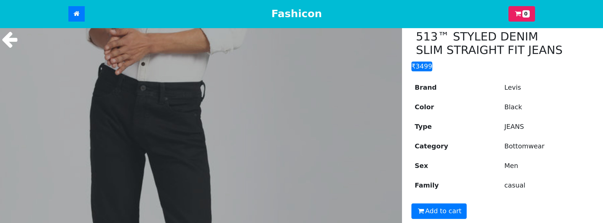
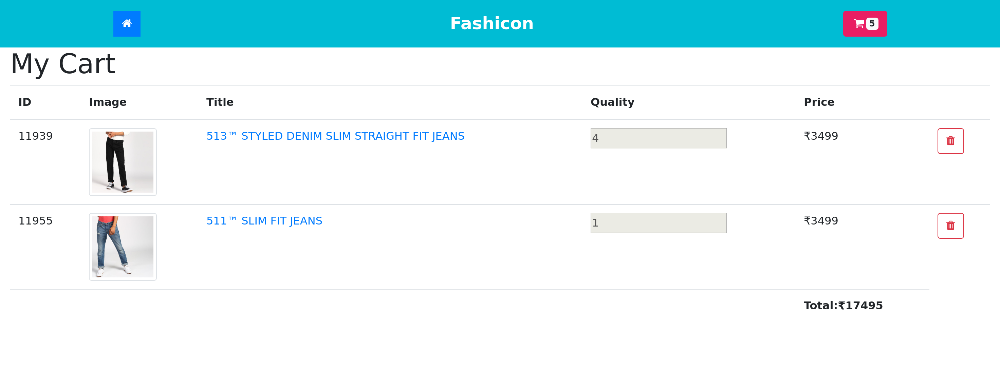

## Steps for running the project

- Clone the repository using ` git clone <repository link> `.
- Navigate to the cloned directory.
- Run ` yarn ` to install dependencies.
- Run ` yarn start ` to start ` localhost `.

### Project Images

## Demo

[Click Here](https://adityatandon007.github.io/React-Redux-Shopping-Cart-app/#/)